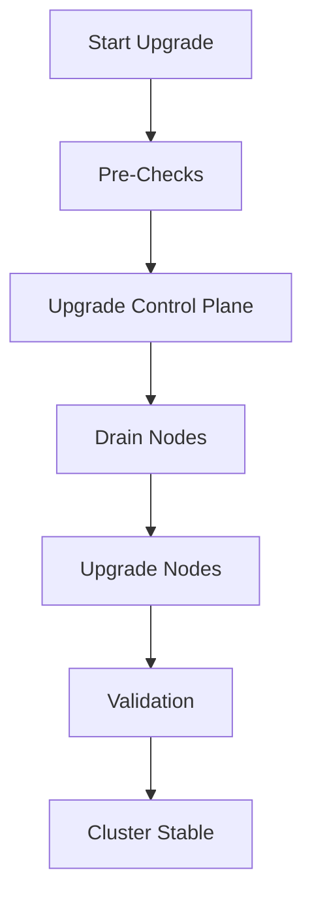

# Kubernetes Cluster Upgrade / Rollout Failure Runbook

## Why This Matters

Cluster upgrades are one of the **highest-risk operations** in Kubernetes.

A small mistake can cause:
- API server downtime
- workload disruption
- node instability
- broken deployments
- CNI networking failure

---

# Upgrade Architecture Flow


---

# Symptoms of Upgrade Failure

## Cluster Level

```bash
kubectl get nodes
```

- NotReady nodes
- version mismatch
- API errors

---

## Workload Level

- pods stuck terminating
- CrashLoopBackOff
- service disruption
- ingress downtime

---

# Step 1 — Pre-Upgrade Checks

## Check Cluster Version

```bash
kubectl version --short
```

---

## Check Node Health

```bash
kubectl get nodes
```

All nodes must be:
- Ready
- stable
- no pressure conditions

---

## Check Deprecated APIs

```bash
kubectl get --raw /metrics
```

Or use tools like:
- kubent (recommended)

---

# Step 2 — Check Workload Readiness

```bash
kubectl get pods -A
```

Ensure:
- no CrashLoopBackOff
- no Pending pods
- no failing deployments

---

# Step 3 — Drain Nodes Safely

```bash
kubectl drain <node-name> --ignore-daemonsets --delete-emptydir-data
```

### Risks:
- pod eviction failures
- PDB blocking drain
- stateful workload disruption

---

# Common Failure Scenarios

---

## 1. Pod Disruption Budget Blocking Upgrade

### Problem

PDB prevents node drain.

### Example

```yaml
minAvailable: 2
```

If only 2 pods exist → drain blocked.

---

### Fix

- temporarily adjust PDB
- scale replicas before upgrade

---

## 2. API Version Deprecation

### Problem

Old API version removed in new cluster.

### Example

```text
extensions/v1beta1 -> apps/v1 removed
```

---

### Fix

- update manifests before upgrade
- validate with policy tools

---

## 3. CNI Plugin Incompatibility

### Problem

Networking breaks after upgrade.

### Symptoms:
- pods cannot communicate
- DNS failures
- service unreachable

---

## 4. Node Drain Failure

### Problem

Pods stuck terminating.

### Cause:
- finalizers blocking deletion
- stuck volumes
- stateful workloads

---

## 5. Control Plane Instability

### Problem

API server latency increases.

### Effect:
- kubectl timeouts
- scheduling delays

---

# Upgrade Workflow



---

# Key Commands

```bash
kubectl get nodes
kubectl get pods -A
kubectl version
kubectl drain <node>
kubectl uncordon <node>
kubectl describe node <node>
```

---

# Rollback Strategy

## When to Rollback

- API server instability
- widespread pod failures
- CNI breakdown
- scheduling failures

---

## Rollback Actions

- revert control plane version
- uncordon nodes
- restore previous config
- redeploy workloads

---

# Production Best Practices

- upgrade one minor version at a time
- always test in staging cluster
- ensure backup of etcd
- validate deprecated APIs
- use surge upgrade strategy
- monitor cluster metrics during upgrade

---

# Observability During Upgrade

Track:
- API server latency
- pod restart rate
- node readiness
- scheduling delays
- network errors

---

# Real Production Incident

## Scenario

- cluster upgraded from 1.24 → 1.26
- some APIs deprecated
- workloads started failing

## Root Cause

- manifests using removed API versions

## Fix

- updated manifests
- re-deployed workloads
- rolled back partially

---

# Interview Questions

## Beginner

1. What is a Kubernetes cluster upgrade?
2. Why do upgrades cause downtime?

---

## Intermediate

3. What is a Pod Disruption Budget?
4. How do you safely drain nodes?

---

## Advanced

5. How would you design zero-downtime cluster upgrades?
6. What risks exist in control plane upgrades?
7. How do you handle API deprecations at scale?

---

# Related Topics

- Kubernetes internals
- Platform engineering
- SRE practices
- Incident management
- Production reliability