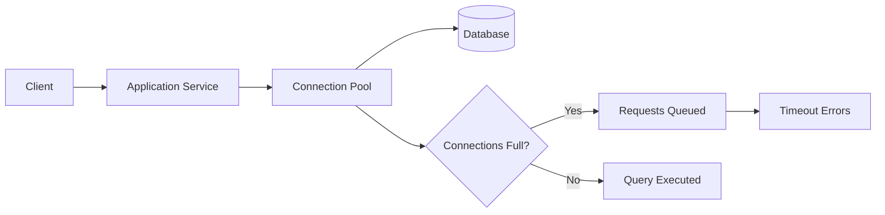
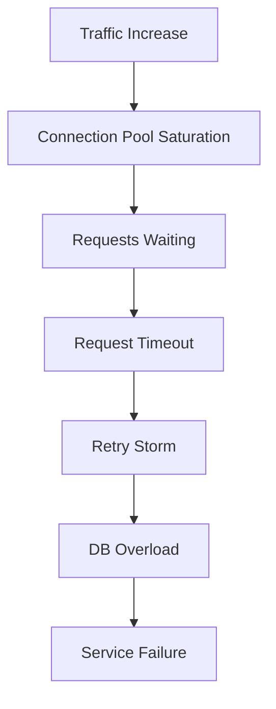
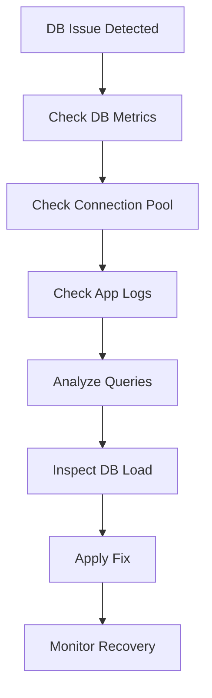

# Database Connection Exhaustion Runbook

## Why This Happens

Database connection exhaustion occurs when:
- all available DB connections are in use
- new requests cannot acquire a connection
- connection pool is misconfigured or overloaded

This leads to:
- API timeouts
- slow responses
- cascading service failures
- retry storms

---

# Architecture Flow



---

# Symptoms

## Application Symptoms

- high latency
- request timeouts
- 502 / 504 errors
- sudden spike in retries

---

## Database Symptoms

- high number of active connections
- “too many connections” errors
- slow query execution
- connection saturation alerts

---

# Step 1 — Check Database Connections

### PostgreSQL

```sql
SELECT count(*) FROM pg_stat_activity;
```

### MySQL

```sql
SHOW PROCESSLIST;
```

---

# Step 2 — Check Connection Pool Metrics

Look for:
- max pool size reached
- waiting threads
- connection acquisition time

---

# Step 3 — Check Application Logs

```bash
kubectl logs <pod-name>
```

Look for:

```text
Timeout acquiring connection
Connection pool exhausted
Too many connections
```

---

# Common Failure Scenarios

---

## 1. Connection Pool Too Small

### Problem

Pool size is too low for traffic.

### Example

```
maxPoolSize = 10
```

### Fix

Increase pool size:

```
maxPoolSize = 50
```

---

## 2. Connection Leak

### Problem

Connections are not returned to pool.

### Cause

- missing close()
- improper async handling

---

### Effect

- gradual exhaustion
- eventual outage

---

## 3. Traffic Spike

### Problem

Sudden increase in requests.

### Effect

- pool saturation
- DB overload
- cascading failures

---

## 4. Slow Queries

### Problem

Long-running queries block connections.

---

### Fix

- add indexes
- optimize queries
- reduce query complexity

---

## 5. Missing Timeouts

### Problem

Connections stay open too long.

---

### Fix

Set:

- query timeout
- connection timeout
- idle timeout

---

# Connection Exhaustion Flow



---

# Debugging Workflow



---

# Key Commands

```bash
kubectl logs <pod>
kubectl get pods
kubectl top pods
```

DB commands:
```sql
SHOW PROCESSLIST;
SELECT * FROM pg_stat_activity;
```

---

# Production Root Causes

## Application Layer
- connection leaks
- improper pooling
- missing timeouts

## Database Layer
- slow queries
- missing indexes
- low max connections

## Infrastructure Layer
- traffic spikes
- insufficient scaling

---

# Prevention Strategies

- use connection pooling properly
- enforce query timeouts
- optimize slow queries
- add DB indexing
- monitor active connections
- implement rate limiting
- use caching layers

---

# Observability Signals

Track:
- active DB connections
- query latency
- pool wait time
- error rate
- retry count

---

# Real Production Scenario

## Incident

- API latency increased gradually
- DB CPU normal
- no deployment changes

## Root Cause

- connection leak in service layer
- pool exhaustion over time

## Fix

- fixed connection handling
- reduced pool size
- added monitoring alerts

---

# Interview Questions

## Beginner

1. What is connection pooling?
2. Why do DB connections get exhausted?

---

## Intermediate

3. How do you detect connection leaks?
4. What happens when DB connections are full?

---

## Advanced

5. How would you design a system to prevent DB saturation?
6. How do retries worsen connection exhaustion?
7. How do you balance pool size vs DB load?

---

# Related Topics

- Databases
- Backend architecture
- Observability
- SRE practices
- Production failures