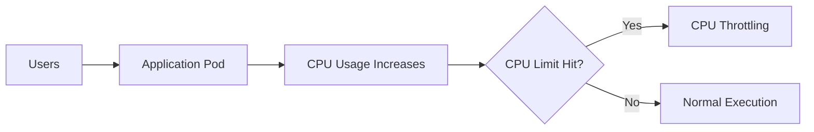
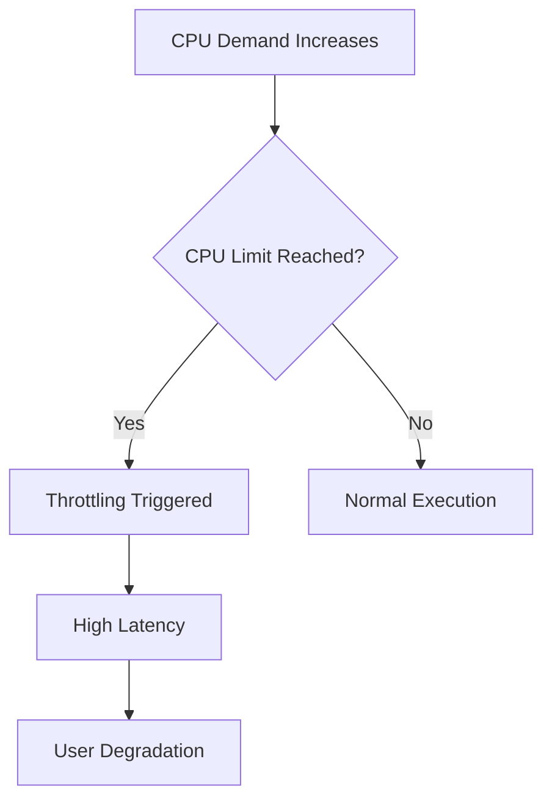
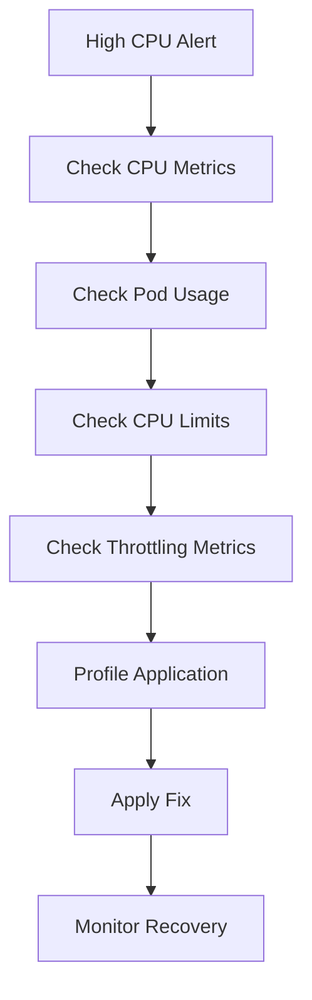

# High CPU Usage / CPU Throttling Runbook

## Why This Happens

High CPU usage in Kubernetes occurs when:
- application load increases
- inefficient code runs hot loops
- CPU limits are too strict
- too many requests hit the service
- background jobs consume compute

Unlike memory issues, CPU issues often cause:
- slow responses
- request timeouts
- latency spikes
- degraded throughput

---

# CPU Architecture Flow



---

# Symptoms

## Application Symptoms

- slow API responses
- increased latency
- request timeouts
- degraded throughput
- uneven performance under load

---

## Kubernetes Symptoms

```bash
kubectl top pods
```

Example:

```text
NAME        CPU(cores)   MEMORY(bytes)
api-pod     950m         200Mi
```

---

# Step 1 — Check CPU Usage

```bash
kubectl top pods
kubectl top nodes
```

Look for:
- pods near or above CPU limits
- nodes at high CPU utilization

---

# Step 2 — Check Pod Limits

```bash
kubectl describe pod <pod-name>
```

Look for:

```yaml
resources:
  limits:
    cpu: "500m"
```

---

# Step 3 — Detect CPU Throttling

CPU throttling happens when usage exceeds limits.

Check metrics:
- Prometheus (recommended)
- container_cpu_cfs_throttled_seconds_total

---

# Common Failure Scenarios

---

## 1. CPU Throttling Due to Low Limits

### Problem

CPU limits too low for workload.

### Effect

- requests slowed artificially
- poor latency
- unpredictable performance

---

### Fix

Increase CPU limits:

```yaml
resources:
  requests:
    cpu: "250m"

  limits:
    cpu: "1000m"
```

---

## 2. Traffic Spike

### Problem

Sudden increase in requests.

### Effect

- CPU saturation
- request queueing
- latency spikes

---

### Fix

- enable Horizontal Pod Autoscaler

```yaml
metrics:
  - type: Resource
    resource:
      name: cpu
      target:
        type: Utilization
        averageUtilization: 70
```

---

## 3. Inefficient Code Path

### Problem

Hot loops or expensive operations.

### Examples

- JSON parsing bottlenecks
- heavy regex operations
- blocking synchronous calls

---

## 4. Node-Level CPU Saturation

### Problem

Multiple pods competing for CPU.

### Effect

- noisy neighbor problem
- unpredictable latency

---

# CPU Throttling Flow



---

# Debugging Workflow



---

# Key Commands

```bash
kubectl top pods
kubectl top nodes
kubectl describe pod <pod>
kubectl get hpa
```

---

# Production Root Causes

## Application Layer
- inefficient algorithms
- blocking calls
- high concurrency

## Kubernetes Layer
- too low CPU limits
- missing autoscaling

## Infrastructure Layer
- node CPU saturation
- noisy neighbor workloads

---

# Prevention Strategies

- set realistic CPU requests/limits
- enable HPA
- optimize application performance
- distribute workloads across nodes
- use profiling tools
- monitor throttling metrics

---

# Observability Signals

Track:
- CPU usage per pod
- throttling metrics
- request latency
- HPA scaling events
- node CPU saturation

---

# Real Production Scenario

## Incident

- API response time increased from 200ms → 2s
- no pod restarts
- CPU usage at 100%

## Root Cause

- CPU limit too low (500m)
- traffic spike caused throttling

## Fix

- increased CPU limits
- enabled HPA
- optimized heavy query path

---

# Interview Questions

## Beginner

1. What is CPU throttling?
2. Difference between CPU requests and limits?

---

## Intermediate

3. How do you detect CPU bottlenecks?
4. Why does high CPU not always mean failure?

---

## Advanced

5. How does Kubernetes enforce CPU limits?
6. How would you design autoscaling for CPU-heavy workloads?
7. How do you differentiate app bottleneck vs infrastructure bottleneck?

---

# Related Topics

- Kubernetes Scheduling
- Autoscaling
- Observability
- Performance Engineering
- Production Failures