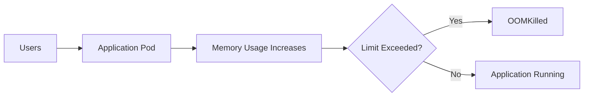
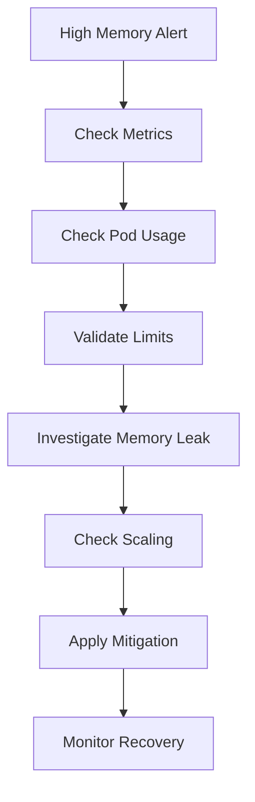
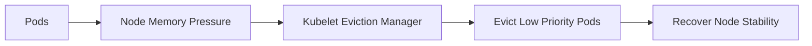

# High Memory Usage Runbook

## Why This Happens

High memory usage occurs when applications consume more memory than expected.

This can lead to:
- slow application performance
- container restarts
- OOMKilled events
- node instability
- cascading failures

In Kubernetes, memory exhaustion is one of the most common production incidents.

---

# Common Causes

| Cause | Description |
|---|---|
| Memory leaks | Application continuously allocates memory |
| Large caches | Excessive in-memory caching |
| Traffic spikes | Increased request load |
| Poor garbage collection | Delayed memory cleanup |
| Unbounded queues | Messages accumulate in memory |
| Large queries | High-memory database operations |
| Missing limits | Containers consume unlimited memory |

---

# Architecture Flow



---

# Symptoms

## Application Symptoms

- slow response times
- increased latency
- request timeouts
- random restarts
- degraded throughput

---

## Kubernetes Symptoms

```bash
kubectl get pods
```

Example:

```text
api-6c9d7f5f8c-abcde   0/1   OOMKilled
```

---

# Initial Investigation

## Check Pod Status

```bash
kubectl describe pod <pod-name>
```

Look for:

```text
Reason: OOMKilled
```

---

## Check Resource Usage

```bash
kubectl top pods
```

Example:

```text
NAME      CPU(cores)   MEMORY(bytes)
api       250m         950Mi
```

---

## Check Node Usage

```bash
kubectl top nodes
```

---

# Common Failure Patterns

# 1. Missing Memory Limits

## Problem

Containers consume unlimited memory.

## Bad Example

```yaml
resources: {}
```

---

## Recommended Fix

```yaml
resources:
  requests:
    memory: "256Mi"

  limits:
    memory: "512Mi"
```

---

# 2. Memory Leaks

## Symptoms

- gradual memory increase
- pod restarts after long uptime
- recurring OOMKilled events

---

## Investigation

Monitor memory growth over time.

Use:
- Prometheus
- Grafana
- application profiling

---

# 3. Excessive Caching

## Problem

Applications cache too much data in memory.

---

## Examples

- unbounded Redis caching
- in-memory object storage
- large session storage

---

## Mitigation

- configure cache eviction
- limit object size
- externalize storage

---

# 4. Traffic Spikes

## Problem

Sudden traffic increase causes:
- more requests
- more memory allocation
- higher concurrency

---

## Detection

Monitor:
- request rate
- latency
- pod scaling behavior

---

# Kubernetes Debugging Workflow



---

# Investigating OOMKilled

## Describe Pod

```bash
kubectl describe pod <pod-name>
```

---

## Check Previous Logs

```bash
kubectl logs <pod-name> --previous
```

---

## Check Events

```bash
kubectl get events --sort-by=.metadata.creationTimestamp
```

---

# Production Mitigations

# Horizontal Pod Autoscaler (HPA)

Scale pods automatically.

```yaml
apiVersion: autoscaling/v2
kind: HorizontalPodAutoscaler

metadata:
  name: api-hpa

spec:
  scaleTargetRef:
    apiVersion: apps/v1
    kind: Deployment
    name: api

  minReplicas: 2
  maxReplicas: 10

  metrics:
  - type: Resource
    resource:
      name: memory

      target:
        type: Utilization
        averageUtilization: 70
```

---

# Vertical Pod Autoscaler (VPA)

Automatically adjusts resource requests.

Use carefully for:
- stateful workloads
- memory-heavy apps

---

# Node-Level Risks

High memory usage can impact:
- kubelet
- system daemons
- neighboring pods

This may trigger:
- node pressure
- pod eviction
- cluster instability

---

# Kubernetes Eviction Flow



---

# Production Best Practices

- always define resource requests and limits
- monitor memory trends
- use autoscaling
- avoid unbounded caching
- test under load
- implement graceful degradation

---

# Prevention Strategies

| Strategy | Benefit |
|---|---|
| Resource limits | Prevent node exhaustion |
| HPA | Automatic scaling |
| Load testing | Detect scaling limits |
| Observability | Early issue detection |
| Memory profiling | Detect leaks |

---

# Real-World Production Scenario

## Scenario

An API service experiences:
- increasing latency
- pod restarts
- elevated memory usage

Investigation shows:
- large in-memory cache
- no eviction policy
- memory limit exceeded

Result:
- repeated OOMKilled events
- deployment instability

Mitigation:
- add cache eviction
- reduce cache size
- increase replicas
- optimize memory usage

---

# Tradeoffs

| Strategy | Advantage | Disadvantage |
|---|---|---|
| Higher memory limits | Fewer OOM events | Higher infrastructure cost |
| Aggressive autoscaling | Better resilience | Increased complexity |
| Large caches | Faster responses | Memory pressure |
| VPA | Automatic tuning | Potential restarts |

---

# Interview Questions

## Beginner

1. What causes OOMKilled?
2. Difference between requests and limits?

---

## Intermediate

3. How do you debug high memory usage?
4. Why are memory limits important?

---

## Advanced

5. How would you investigate intermittent OOMKilled events?
6. How do memory leaks impact Kubernetes clusters?
7. When would you use HPA vs VPA?

---

# Related Topics

- Kubernetes
- Observability
- Autoscaling
- Incident Management
- Production Failures