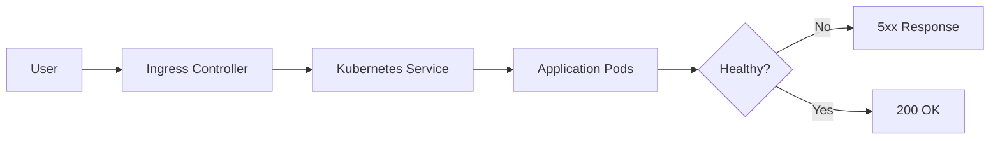
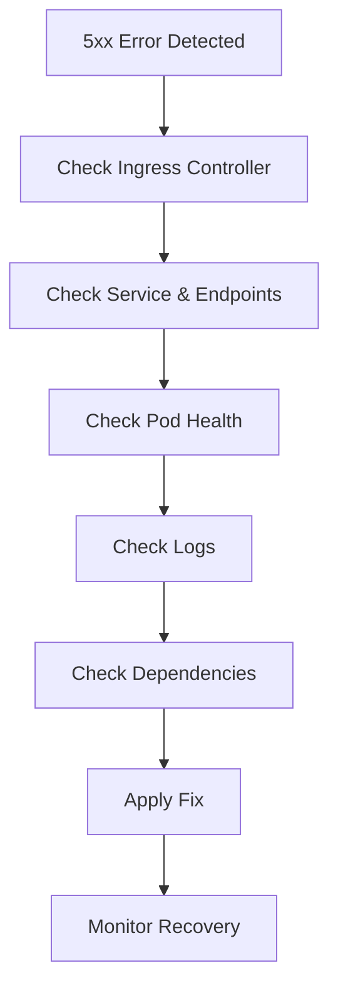

# Ingress 5xx Errors Runbook

## Why This Happens

Ingress 5xx errors (502, 503, 504) indicate that traffic is reaching the ingress layer
but failing before a valid response is returned.

This usually means:
- upstream service is unhealthy
- networking issue between ingress and service
- misconfigured timeouts
- pod failures or scaling issues

---

# Common Error Types

| Error | Meaning |
|---|---|
| 502 Bad Gateway | upstream service not reachable |
| 503 Service Unavailable | no healthy backend pods |
| 504 Gateway Timeout | upstream took too long to respond |

---

# Architecture Flow



---

# Symptoms

## User Impact

- API requests failing
- frontend showing errors
- timeouts in browser
- increased latency

---

## Kubernetes Symptoms

```bash
kubectl get pods
```

Possible issues:
- CrashLoopBackOff
- 0/1 Ready pods
- high restart counts

---

# Step 1 — Check Ingress Controller

```bash
kubectl get pods -n ingress-nginx
```

Check:
- ingress controller running
- no restarts
- no CPU/memory pressure

---

# Step 2 — Check Service

```bash
kubectl get svc
```

Validate:
- correct selector labels
- correct port mapping
- endpoints exist

---

# Step 3 — Check Endpoints

```bash
kubectl get endpoints <service-name>
```

If empty:
👉 pods are not healthy or not matching labels

---

# Step 4 — Check Pods

```bash
kubectl get pods -o wide
```

Look for:
- CrashLoopBackOff
- Pending pods
- Not Ready state

---

# Common Failure Scenarios

---

## 1. No Healthy Pods (503)

### Cause
- deployment failed
- pods not ready
- failing readiness probe

### Fix
- check logs
- fix readiness probe
- ensure correct labels

---

## 2. Timeout (504)

### Cause
- slow backend service
- database latency
- network delays

### Fix
- increase timeout settings
- optimize backend calls
- scale pods

---

## 3. Bad Gateway (502)

### Cause
- ingress cannot reach service
- wrong port mapping
- pod crashed

### Fix
- verify service port
- check container port
- validate endpoints

---

# Debugging Flow



---

# Ingress Debug Commands

```bash
kubectl describe ingress <name>
kubectl logs -n ingress-nginx <controller-pod>
kubectl get events --sort-by=.metadata.creationTimestamp
```

---

# Production Root Causes

## Application Layer
- crashes
- dependency failures
- memory leaks

## Kubernetes Layer
- wrong labels
- missing endpoints
- misconfigured probes

## Networking Layer
- DNS failure
- service mismatch
- port mismatch

## Infrastructure Layer
- node failure
- autoscaling delay

---

# Prevention Strategies

- always define readiness probes
- use proper service selectors
- monitor ingress metrics
- enable autoscaling
- configure timeouts properly
- add circuit breakers

---

# Observability Signals

Monitor:
- 5xx rate
- request latency
- pod restart count
- ingress controller logs
- endpoint health

---

# Interview Questions

## Beginner

1. What is a 502 error in Kubernetes?
2. Difference between 502 and 503?

---

## Intermediate

3. How do you debug ingress 5xx errors?
4. Why do endpoints become empty?

---

## Advanced

5. How would you design resilience for ingress failures?
6. How do timeouts cause 504 errors?
7. How would you reduce blast radius of ingress failures?

---

# Related Topics

- Kubernetes networking
- Observability
- SRE incident response
- Load balancing
- Production failures