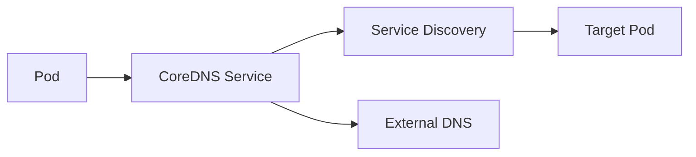
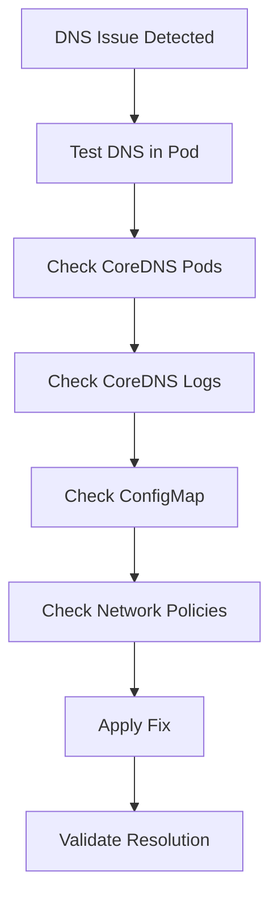

# Kubernetes DNS Failures Runbook

## Why This Happens

DNS failures in Kubernetes cause services to be unable to resolve:
- service names
- internal APIs
- external domains (sometimes)

This leads to:
- application failures
- cascading service outages
- high latency
- retry storms

DNS issues are often **invisible at first glance**.

---

# Architecture Flow



---

# Symptoms

## Application Level

- connection timeouts
- “host not found” errors
- API failures
- sudden spike in retries

---

## Kubernetes Level

```bash
kubectl get pods -n kube-system
```

Look for CoreDNS:

```text
coredns-xxxx   CrashLoopBackOff
coredns-xxxx   0/1 Running
```

---

# Step 1 — Check CoreDNS Status

```bash
kubectl get pods -n kube-system -l k8s-app=kube-dns
```

If unhealthy:
- restart loop
- crashloop
- high CPU/memory

---

# Step 2 — Check CoreDNS Logs

```bash
kubectl logs -n kube-system deployment/coredns
```

Look for:
- SERVFAIL
- timeout errors
- plugin failures
- upstream DNS issues

---

# Step 3 — Test DNS Inside Pod

```bash
kubectl exec -it <pod-name> -- nslookup kubernetes.default
```

OR

```bash
kubectl exec -it <pod-name> -- cat /etc/resolv.conf
```

---

# Step 4 — Check Cluster DNS Service

```bash
kubectl get svc -n kube-system
```

Ensure:
- kube-dns service exists
- correct ClusterIP
- correct port (53 UDP/TCP)

---

# Common Failure Scenarios

---

## 1. CoreDNS CrashLoopBackOff

### Cause
- misconfigured CoreDNS configmap
- plugin failure
- memory pressure

### Fix

```bash
kubectl rollout restart deployment coredns -n kube-system
```

---

## 2. DNS Resolution Timeout

### Cause
- overloaded CoreDNS
- high query volume
- node networking issues

### Fix
- scale CoreDNS

```bash
kubectl scale deployment coredns -n kube-system --replicas=3
```

---

## 3. Incorrect resolv.conf in Pods

### Cause
- custom DNS config
- overridden DNS policy

### Fix

Check:

```yaml
dnsPolicy: ClusterFirst
```

---

## 4. Upstream DNS Failure

### Cause
- external DNS provider down
- VPC DNS failure (AWS)
- network routing issue

---

# Debugging Flow



---

# CoreDNS Config Check

```bash
kubectl get configmap coredns -n kube-system -o yaml
```

Look for:
- forwarders
- cluster domain
- plugins

---

# Production Root Causes

## Cluster Layer
- CoreDNS overload
- insufficient replicas
- bad configmap changes

## Network Layer
- CNI issues
- network policy blocking DNS
- node-level packet loss

## Application Layer
- wrong DNS policy
- custom resolv.conf overrides

---

# Prevention Strategies

- always run multiple CoreDNS replicas
- monitor DNS latency
- avoid frequent CoreDNS config changes
- enable autoscaling for CoreDNS
- use network policies carefully
- monitor query volume spikes

---

# Observability Metrics

Track:
- DNS request latency
- query failure rate
- CoreDNS CPU usage
- CoreDNS memory usage
- SERVFAIL rate

---

# Real Production Scenario

## Incident

- APIs started timing out
- no code changes
- pods healthy
- ingress stable

## Root Cause

CoreDNS memory spike → restarted → DNS resolution failures

## Fix

- scaled CoreDNS
- added resource limits
- stabilized traffic

---

# Interview Questions

## Beginner

1. What is CoreDNS?
2. What happens when DNS fails in Kubernetes?

---

## Intermediate

3. How do you debug DNS issues in a cluster?
4. Why would pods fail while running but not resolving services?

---

## Advanced

5. How would you design resilient DNS in large clusters?
6. What causes CoreDNS overload in production?
7. How do network policies affect DNS resolution?

---

# Related Topics

- Kubernetes Networking
- CoreDNS
- Observability
- Incident Management
- Production Failures