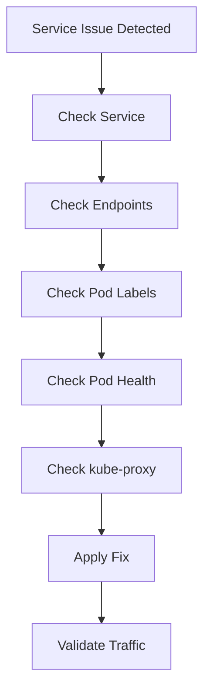

# Kubernetes Service / Endpoints Failure Runbook

## Why This Happens

Kubernetes services rely on:
- Services (stable virtual IP)
- Endpoints (backing pods)
- kube-proxy (traffic routing)
- CoreDNS (service discovery)

When any of these break, applications experience:
- connection failures
- timeouts
- 5xx errors
- intermittent connectivity

---

# Architecture Flow


---

# Symptoms

## Application Symptoms

- connection refused
- timeout errors
- intermittent failures
- service unreachable

---

## Kubernetes Symptoms

```bash
kubectl get svc
kubectl get endpoints
kubectl get pods
```

---

# Step 1 — Check Service

```bash
kubectl get svc <service-name>
```

Validate:
- correct ClusterIP
- correct ports
- correct selectors

---

# Step 2 — Check Endpoints

```bash
kubectl get endpoints <service-name>
```

### Critical Check

If endpoints are EMPTY:

👉 Service has no healthy pods attached

---

# Step 3 — Check Pod Labels

```bash
kubectl get pods --show-labels
```

Compare with service selector:

```yaml
selector:
  app: api
```

---

# Common Failure Scenarios

---

## 1. Selector Mismatch (Most Common)

### Problem

Service selector does not match pod labels.

### Example

Service:
```yaml
selector:
  app: backend
```

Pods:
```yaml
labels:
  app: api
```

### Result

- No endpoints created
- Service returns no traffic

---

## 2. No Ready Pods

### Problem

Pods exist but are not "Ready"

### Check

```bash
kubectl get pods
```

Look for:
- 0/1 READY

---

## 3. kube-proxy Failure

### Problem

Service exists but routing fails

### Symptoms

- intermittent connectivity
- DNS resolves but traffic fails

---

## 4. Port Mismatch

### Problem

Service port != container port

### Example

```yaml
servicePort: 80
containerPort: 8080
```

---

## 5. Endpoint Controller Delay

### Problem

Endpoints not updated yet after deployment

---

# Debugging Workflow



---

# Key Commands

```bash
kubectl get svc
kubectl get endpoints
kubectl describe svc <name>
kubectl get pods --show-labels
kubectl get events
```

---

# Production Root Causes

## Kubernetes Layer
- wrong label selectors
- missing endpoints
- kube-proxy misconfiguration

## Application Layer
- pods not ready
- readiness probe failure

## Network Layer
- CNI issues
- iptables problems

---

# Prevention Strategies

- always validate labels before deployment
- use readiness probes
- monitor endpoint count
- avoid manual label changes
- automate service validation in CI/CD

---

# Observability Metrics

Track:
- endpoint availability
- request success rate
- kube-proxy health
- service latency
- DNS resolution success rate

---

# Real Production Scenario

## Incident

- API service unreachable
- pods running normally
- no recent deployment failure

## Root Cause

- service selector changed from `app: api` → `app: backend`
- endpoints became empty

## Fix

- corrected selector
- redeployed service
- restored endpoints

---

# Interview Questions

## Beginner

1. What is a Kubernetes Service?
2. What are endpoints?

---

## Intermediate

3. Why would a service have no endpoints?
4. How does kube-proxy work?

---

## Advanced

5. How would you debug intermittent service failures?
6. What happens when selectors mismatch?
7. How does service discovery work in Kubernetes?

---

# Related Topics

- Kubernetes Networking
- CoreDNS
- kube-proxy
- Observability
- Production Failures