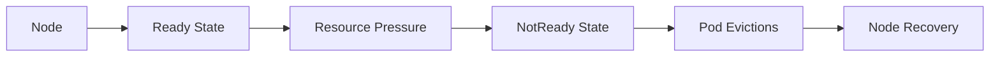
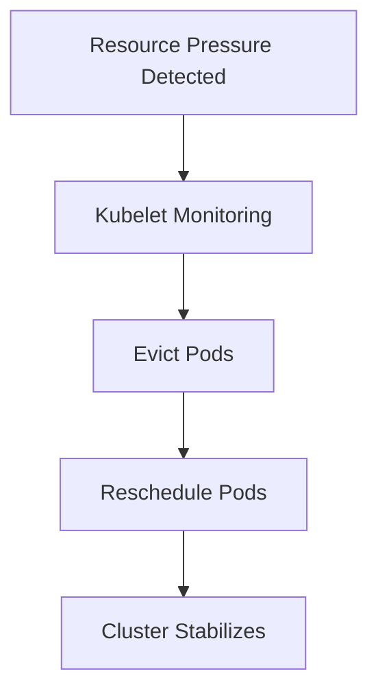
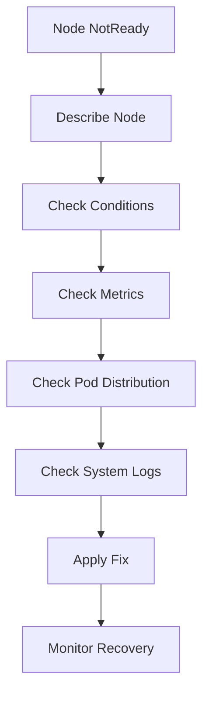

# Node Not Ready / Node Pressure Runbook

## Why This Happens

A Kubernetes node becomes **NotReady** when the kubelet cannot guarantee it can safely run workloads.

This usually indicates:
- resource exhaustion
- network issues
- kubelet failure
- disk pressure
- memory pressure
- CPU starvation

When a node is NotReady, workloads may:
- stop scheduling
- get evicted
- experience downtime

---

# Node Lifecycle



---

# Symptoms

## Kubernetes Symptoms

```bash
kubectl get nodes
```

Example:

```text
ip-10-0-1-12   NotReady   1d
```

---

## Workload Symptoms

- pods stuck in Pending
- sudden pod evictions
- increased restart count
- service degradation
- higher latency

---

# Step 1 — Check Node Status

```bash
kubectl describe node <node-name>
```

Look for:

- MemoryPressure
- DiskPressure
- PIDPressure
- NetworkUnavailable

---

# Step 2 — Check Node Conditions

```bash
kubectl get node <node-name> -o json | jq .status.conditions
```

---

# Common Node Conditions

| Condition | Meaning |
|---|---|
| MemoryPressure | Node running out of memory |
| DiskPressure | Disk space low |
| PIDPressure | Too many processes |
| Ready | Node healthy/unhealthy |

---

# Step 3 — Check Pod Distribution

```bash
kubectl get pods -o wide
```

Look for:
- pods concentrated on one node
- uneven scheduling
- eviction patterns

---

# Step 4 — Check Node Resource Usage

```bash
kubectl top nodes
```

Example:

```text
NAME           CPU(cores)   MEMORY(bytes)
node-1         95%          98%
```

---

# Common Failure Scenarios

---

## 1. Memory Pressure

### Cause
- too many pods
- memory leaks
- large workloads

### Effect
- kubelet evicts pods
- node becomes NotReady

---

### Fix

- reduce workload density
- add more nodes
- enforce resource limits

---

## 2. Disk Pressure

### Cause
- log accumulation
- container images filling disk
- no log rotation

### Fix

```bash
sudo du -sh /var/lib/docker
```

- clean unused images
- enable log rotation
- expand disk volume

---

## 3. Kubelet Crash

### Cause
- misconfiguration
- runtime failure
- certificate expiry

### Fix

```bash
systemctl restart kubelet
```

---

## 4. Network Failure

### Cause
- CNI plugin failure
- routing issues
- cloud networking problems

---

# Node Eviction Flow



---

# Debugging Workflow



---

# Key Commands

```bash
kubectl get nodes
kubectl describe node <node>
kubectl top nodes
kubectl get pods -o wide
kubectl get events
```

---

# Production Root Causes

## Infrastructure
- insufficient node capacity
- disk full
- hardware failure

## Kubernetes Layer
- kubelet crash
- eviction thresholds reached
- misconfigured taints

## Application Layer
- memory leaks
- CPU spikes
- unbounded workloads

---

# Prevention Strategies

- set resource requests and limits
- use cluster autoscaler
- monitor node health metrics
- enable log rotation
- distribute workloads evenly
- use pod disruption budgets

---

# Observability Signals

Monitor:
- node readiness status
- memory usage trends
- disk usage
- pod eviction events
- kubelet logs

---

# Real Production Scenario

## Incident

- multiple pods suddenly evicted
- node marked NotReady
- services degraded

## Root Cause

- disk filled due to log explosion
- kubelet triggered DiskPressure eviction

## Fix

- cleaned logs
- added log rotation
- increased disk size
- redistributed pods

---

# Interview Questions

## Beginner

1. What does NodeNotReady mean?
2. What causes pod eviction?

---

## Intermediate

3. How do you debug a NotReady node?
4. What is DiskPressure?

---

## Advanced

5. How does kubelet decide to evict pods?
6. How would you design a resilient cluster for node failures?
7. How do taints and tolerations affect node scheduling?

---

# Related Topics

- Kubernetes internals
- Cluster autoscaling
- SRE reliability
- Infrastructure monitoring
- Production failures