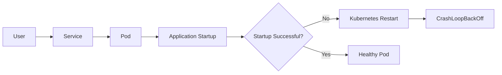
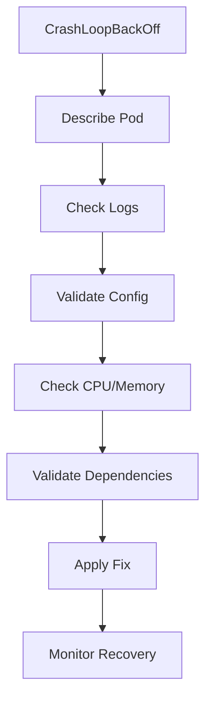

# Pod CrashLoopBackOff Runbook

## Why This Happens

A pod enters `CrashLoopBackOff` when:

- the container repeatedly crashes
- Kubernetes continuously retries restarting it
- startup failures exceed retry thresholds

This is one of the most common Kubernetes production failures.

---

# Common Causes

| Cause | Description |
|---|---|
| Bad environment variables | Missing or invalid configuration |
| Secret failures | Secret not mounted correctly |
| Database unavailable | App cannot connect to DB |
| Invalid startup command | Container exits immediately |
| Port conflicts | Application binds incorrectly |
| OOMKilled | Container exceeds memory limit |
| Dependency failures | External services unavailable |

---

# Architecture Flow



---

# Symptoms

## Pod Status

```bash
kubectl get pods
```

Example:

```text
api-7f9c6d9b5d-abcde   0/1   CrashLoopBackOff
```

---

# Initial Investigation

## Describe Pod

```bash
kubectl describe pod <pod-name>
```

Check:
- events
- restart count
- image pull errors
- probe failures

---

## View Logs

```bash
kubectl logs <pod-name>
```

For previous container crashes:

```bash
kubectl logs <pod-name> --previous
```

---

# Common Failure Patterns

## 1. Missing Environment Variables

### Symptoms

Application startup failure.

Example:

```text
DATABASE_URL not found
```

### Debugging

```bash
kubectl describe pod <pod-name>
```

Check:
- ConfigMaps
- Secrets
- env variables

---

# 2. Secret Mount Failure

### Symptoms

```text
secret "db-secret" not found
```

### Validation

```bash
kubectl get secrets
```

---

# 3. OOMKilled

### Symptoms

```text
Reason: OOMKilled
```

### Validation

```bash
kubectl describe pod <pod-name>
```

### Fix

Increase memory limits:

```yaml
resources:
  limits:
    memory: "512Mi"
```

---

# 4. Readiness Probe Failure

### Symptoms

```text
Readiness probe failed
```

### Causes

- wrong health endpoint
- slow startup
- dependency unavailable

### Example

```yaml
readinessProbe:
  httpGet:
    path: /health
    port: 8080
```

---

# Production Debugging Workflow



---

# Production Best Practices

- use readiness probes
- configure resource limits
- externalize configuration
- centralize logs
- implement graceful shutdown
- validate secrets before deployment

---

# Prevention Strategies

| Strategy | Benefit |
|---|---|
| Health checks | Detect failures early |
| CI validation | Catch config issues |
| Progressive deployments | Reduce blast radius |
| Resource limits | Prevent node exhaustion |
| Observability | Faster troubleshooting |

---

# Interview Questions

## Beginner

1. What is CrashLoopBackOff?
2. Why do containers restart repeatedly?

---

## Intermediate

3. How do you debug a crashing pod?
4. Difference between liveness and readiness probes?

---

## Advanced

5. How would you reduce deployment blast radius?
6. How do you debug intermittent startup failures?
7. How would you prevent CrashLoopBackOff in production?

---

# Related Topics

- Kubernetes
- Observability
- CI/CD
- Incident Management
- Production Failures